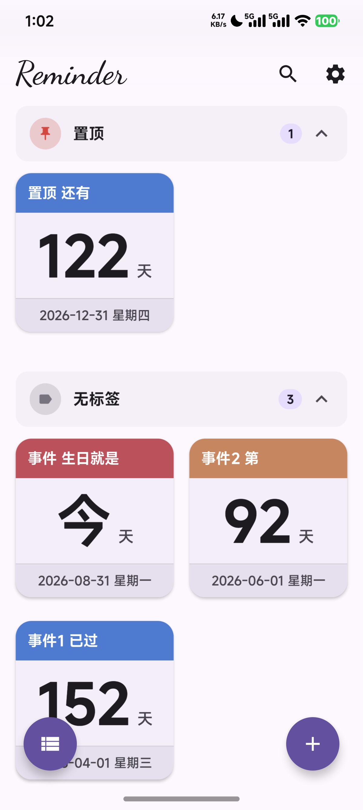
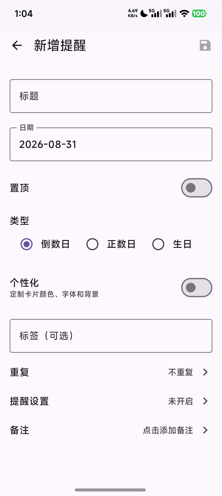
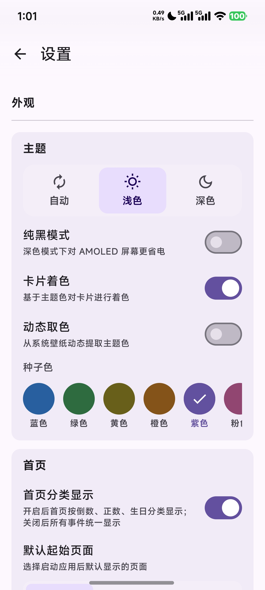
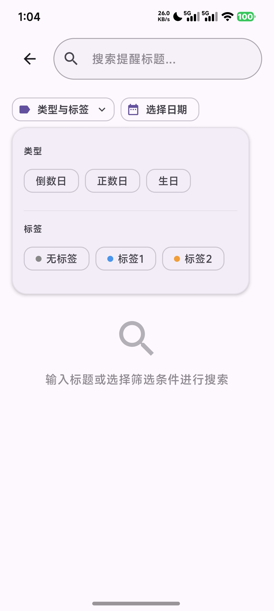
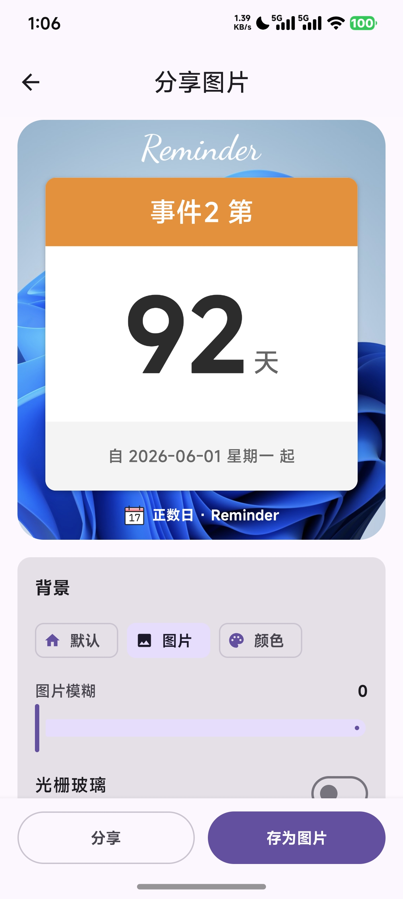
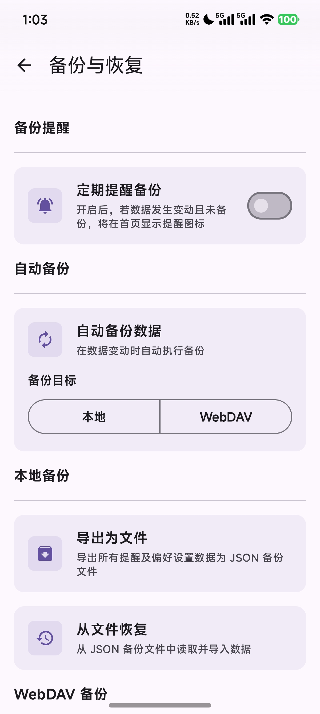
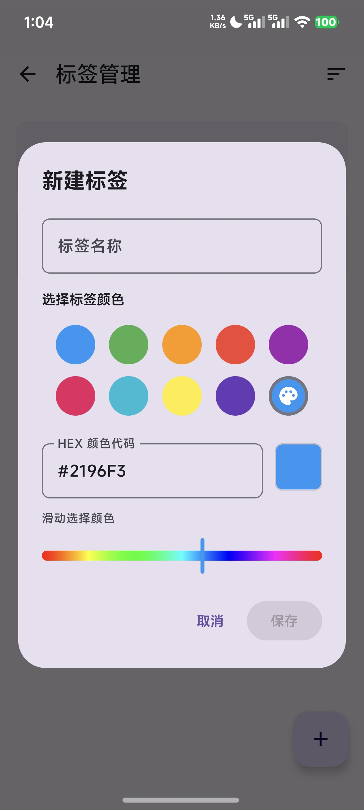
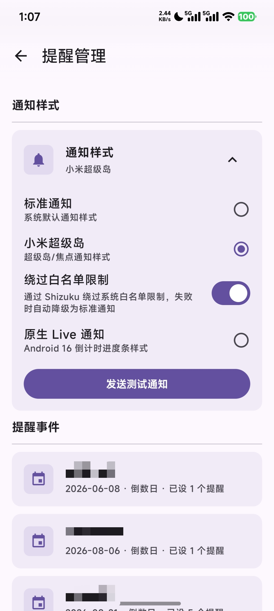

# Reminder

### 一款 Material 3 风格的安卓纪念日 / 倒数日管理应用

---

## 项目简介

Reminder 是一款简洁的安卓纪念日 / 倒数日管理应用，支持倒数与正数两种模式，帮助你轻松掌握重要日期。应用完全使用 **Jetpack Compose** 构建，全面对齐 Material 3 设计标准。

本项目 fork 自 [lentikr/Reminder](https://github.com/lentikr/Reminder)，在原有基础上加入了多项分支独有功能，感谢原作者的贡献！

> [!CAUTION]
> **注意事项：**
> 由于应用包名不同，系统会视其为一个**全新的应用**。你将无法直接覆盖安装老版本。在安装此版本前，请务必先**备份老版本的数据**，卸载老版本后再安装新版本，并使用内置的 JSON 备份导入功能恢复数据。

## 功能概览

### ✨ 分支新增特性

- **界面焕然一新：** 全新的视觉设计与流畅动画；可自由定制每条提醒的颜色、图标和背景，还能统一显示所有事件、滚动时自动收起底栏，大屏和横屏下显示效果也更好
- **隐私更安全：** 支持手势密码和指纹、面部解锁，离开应用再回来需要验证，还能禁止截屏录屏，防止日程被偷看
- **提醒更贴心：** 支持公农历生日提醒，自动显示生肖、星座和年龄；到点精确提醒，重启手机也不会漏掉；能自动同步到手机日历，还能在"提醒管理"里集中查看和修改所有提醒
- **数据不丢失：** 一键备份到自己的网盘或手机本地，内容加密保存，换机、重装都能轻松恢复
- **桌面小组件：** 提供三种大小的桌面小组件，文字大小自动调整，重要日子一眼可见
- **分享与记录：** 可以把提醒做成精美图片卡片保存或分享给朋友，支持光栅玻璃质感的个性化背景；详情页翻一翻卡片就能查看备注
- **通知新玩法：** 多种通知样式可选：普通通知、实时提醒，小米手机还支持灵动岛
- **更多细节：** 应用内检查更新、多标签整理与高级搜索，以及大量体验细节优化

### 📌 原有基础功能

- **倒数日与正数日：** 倒数日提醒生日、纪念日等未来事件；正数日记录"来到世界的第 N 天"；支持农历并可选自动换算下一个农历日期
- **分组与置顶：** 为每个提醒设置分类快速整理，重要提醒置顶显示
- **重复周期：** 支持设置重复周期（x 天、x 周、x 月、x 年）
- **分享与导出：** 以图片形式保存或分享纪念日
- **外观设置：** 自动 / 浅色 / 深色三种主题模式；深色模式下可启用纯黑主题适配 AMOLED；卡片化与列表两种布局

## 开源致谢

Reminder 的实现受益于以下上游项目与开源组件，感谢所有贡献者：

- [lentikr/Reminder](https://github.com/lentikr/Reminder)：上游原始项目；
- [Tyme](https://github.com/6tail/tyme4kt)：强大的公农历 / 干支 / 星座换算日历工具库；
- [Accompanist](https://github.com/google/accompanist)：权限申请与分页指示组件；
- [Capturable](https://github.com/PatilShreyas/Capturable)：Compose 界面截图分享；
- [compose-m3-picker](https://github.com/Seo-4d696b75/compose-m3-picker)：Material 3 风格滚轮选择器；
- [HyperNotification](https://github.com/xzakota/HyperNotification)：小米超级岛通知适配；
- [Shizuku](https://github.com/RikkaApps/Shizuku-API)：高级系统通知能力支持。

## 许可证与第三方声明

Reminder 主体代码以 [GNU General Public License v3](LICENSE) 发布。任何二次分发或衍生作品须遵循 GPLv3 条款同样开源。

第三方库不因本项目的 GPLv3 而自动转为 GPLv3，各自遵循其原始许可证（主要为 Apache License 2.0 与 MIT）。完整的依赖清单、版本号、许可证类型及项目链接，请查看应用内 **设置 → 关于 → 开放源代码许可** 页面。

## 软件界面预览

<table align="center">
  <tr>
    <td></td>
    <td></td>
    <td></td>
    <td></td>
  </tr>
</table>

<table align="center">
  <tr>
    <td></td>
    <td></td>
    <td></td>
    <td></td>
  </tr>
</table>

  

## 反馈与贡献

欢迎在 [Issues](https://github.com/ybhgl/Reminder/issues) 中提交 bug 反馈或功能建议，也欢迎直接提交 Pull Request 参与改进。如果这个项目对你有帮助，别忘了点个 Star 支持一下。

## 免责声明

本项目 fork 自开源项目并仅供学习、研究和个人使用。使用本项目进行日程提醒、日历同步、WebDAV 云端备份等功能时，请自行妥善保管账号凭据与备份数据，并遵守当地法律法规及相关服务的使用条款。项目维护者不对数据丢失、第三方服务可用性或因使用本项目产生的任何后果承担责任。
